# 🧠 **RAG Course Reader – End-to-End LangChain Pipeline**

> **RAG Course Reader** là hệ thống **Retrieval-Augmented Generation (RAG)** giúp **đọc, hiểu và trích dẫn chính xác nội dung tài liệu khóa học** (PDF, Markdown, blog, syllabus, ghi chú học tập, v.v.).  
>  
> Dự án được xây dựng theo kiến trúc **modular end-to-end**, dễ mở rộng, dễ giám sát và triển khai ở môi trường **production-ready**.

---

## 🎯 **Mục tiêu**

- Xây dựng **pipeline RAG hoàn chỉnh** từ *Ingestion → Evaluation*  
- Cho phép người học **truy vấn kiến thức khóa học** và nhận câu trả lời có **trích dẫn chính xác**  
- Tích hợp các thành phần nâng cao: **Monitoring, Caching, Reranking, Guardrails, Multi-tenant dataset**  
- Hỗ trợ cả **OpenAI** và **HuggingFace open-source models**

---

## ⚙️ **Pipeline tổng thể**

```mermaid
graph LR
    A[📥 Ingestion<br/>Thu thập dữ liệu] --> 
    B[🧹 Preprocess<br/>Làm sạch & chuẩn hóa] --> 
    C[✂️ Chunk / Embed<br/>Cắt và sinh embedding] --> 
    D[💾 Index<br/>Lưu vào Vector Store] --> 
    E[🔍 Retrieve<br/>Truy xuất top-k đoạn liên quan] --> 
    F[⚖️ Rerank<br/>Chấm điểm độ liên quan] --> 
    G[🧠 Generate<br/>Sinh câu trả lời bằng LLM] --> 
    H[🔗 Cite<br/>Gắn trích dẫn nguồn] --> 
    I[🧾 Evaluate<br/>Đánh giá bằng RAGAS] --> 
    J[📊 Monitor<br/>Theo dõi bằng Prometheus / Grafana]

```




| Bước | Mô tả |
|------|--------|
| **Ingestion** | Thu thập dữ liệu từ web, sitemap, hoặc file (PDF, Markdown, TXT) |
| **Preprocess** | Làm sạch HTML, chuẩn hóa Markdown, loại trùng lặp |
| **Chunk/Embed** | Cắt đoạn văn bản và sinh embedding (MiniLM / E5) |
| **Index** | Lưu vào vectorstore (Chroma, FAISS, PGVector, Weaviate) |
| **Retrieve** | Truy xuất top-k đoạn liên quan |
| **Rerank** | Chấm điểm lại độ liên quan (CrossEncoder / BGE) |
| **Generate** | Tạo câu trả lời dựa trên ngữ cảnh |
| **Cite** | Gắn trích dẫn tự động [^1] và tooltip HTML |
| **Evaluate** | Đánh giá bằng RAGAS (faithfulness, relevance, recall) |
| **Monitor** | Theo dõi bằng Prometheus, Grafana, Langfuse |

---

## 🗂 **Cấu trúc thư mục**

```bash
rag-course/
├─ .env.example
├─ docker-compose.yml
├─ Dockerfile
├─ requirements.txt
├─ README.md
│
├─ data/
│  ├─ raw/          # Dữ liệu gốc (PDF, HTML, Markdown)
│  ├─ processed/    # Sau khi chuẩn hóa
│  └─ eval/         # Bộ dữ liệu đánh giá RAGAS
│
├─ storage/
│  └─ chroma/       # Vectorstore (multi-tenant)
│
├─ monitoring/      # Prometheus + Grafana config
│  ├─ prometheus/prometheus.yml
│  └─ grafana/
│     ├─ provisioning/
│     │  ├─ datasources/datasource.yml
│     │  └─ dashboards/dashboards.yml
│     └─ dashboards/rag-overview.json
│
├─ src/
│  ├─ api.py              # FastAPI endpoints
│  ├─ ingestion.py        # Thu thập dữ liệu
│  ├─ preprocess.py       # Chuẩn hóa và loại trùng lặp
│  ├─ embed_index.py      # Chunk + embed + index
│  ├─ hybrid_retriever.py # Hybrid BM25 + Dense retriever
│  ├─ reranker.py         # CrossEncoder / BGE reranker
│  ├─ generate.py         # Retrieve → Rerank → Generate → Cite
│  ├─ cache.py            # Redis Semantic Cache
│  ├─ judge.py            # LLM-as-a-Judge (Hallucination check)
│  ├─ evaluate.py         # RAGAS evaluation
│  ├─ observability.py    # Langfuse + OpenTelemetry setup
│  ├─ monitor.py          # Prometheus metrics
│  └─ config.py           # Cấu hình hệ thống
│
└─ scripts/
   ├─ ingest_urls.yaml
   └─ run_api.sh
```

---

## 🧰 **Công nghệ chính**

| Thành phần | Công nghệ |
|-------------|------------|
| Framework | LangChain v0.3+ (core / community / openai / huggingface) |
| LLMs | GPT-4o, Mixtral, Mistral-7B, Zephyr |
| Embeddings | MiniLM, multilingual-e5, nomic-embed-text |
| Vector Store | Chroma (persist) + Elasticsearch (BM25 hybrid) |
| Cache | Redis Semantic Cache |
| Guardrails | LLM-as-a-Judge |
| Monitoring | Prometheus + Grafana |
| Observability | Langfuse + OpenTelemetry |
| Evaluation | RAGAS |
| API | FastAPI + Uvicorn |
| Container | Docker Compose |

---

## 🧩 **Tính năng nổi bật**

✅ Hybrid Retriever – Kết hợp BM25 (Elasticsearch) + Dense retriever (Chroma)  
✅ Chunking thông minh – MarkdownHeaderTextSplitter giữ nguyên cấu trúc chương/mục  
✅ Redis Semantic Cache – Lưu cache theo mức độ tương đồng ngữ nghĩa  
✅ Guardrails – Dùng LLM thứ hai kiểm tra hallucination  
✅ Observability – Theo dõi qua Langfuse → Prometheus / Grafana  
✅ Citations đẹp – Trích dẫn HTML kèm tooltip từ nguồn gốc  
✅ Multi-tenant VectorStore – Hỗ trợ nhiều dataset khóa học riêng biệt  

---

## ⚙️ **Cài đặt**

### 1️⃣ Clone và thiết lập môi trường

```bash
git clone https://github.com/<yourname>/rag-course.git
cd rag-course
python -m venv .venv && source .venv/bin/activate
pip install -r requirements.txt
cp .env.example .env
```

> Yêu cầu: Python ≥ 3.10, Docker ≥ 24, docker-compose ≥ 2.20

---

### 2️⃣ Chạy full stack bằng Docker Compose

```bash
docker compose up -d --build
```

| Service | Port | Mô tả |
|----------|------|-------|
| rag | 8000 | FastAPI API |
| redis | 6379 | Semantic Cache |
| elasticsearch | 9200 | BM25 Retriever |
| prometheus | 9090 | Metrics Collector |
| grafana | 3000 | Dashboard Visualization |

Truy cập:

- 🧩 FastAPI Docs: http://localhost:8000/docs  
- 📈 Prometheus: http://localhost:9090  
- 📊 Grafana: http://localhost:3000 (admin/admin)

---

### 🔑 Cấu hình .env

```bash
PROVIDER=openai
OPENAI_API_KEY=sk-...
HF_TOKEN=hf_...

EMBEDDING_MODEL=intfloat/multilingual-e5-large
RERANKER_MODEL=BAAI/bge-reranker-v2-m3
OPENAI_MODEL=gpt-4o-mini
CHROMA_DIR=./storage/chroma

# Hybrid retriever
ES_URL=http://elasticsearch:9200
ES_INDEX=rag_bm25
HYBRID_ALPHA=0.5

# Cache
REDIS_URL=redis://redis:6379/0
CACHE_TTL_SEC=3600

# Observability
ENABLE_LANGFUSE=false
ENABLE_OTEL=false
```

---

## 🧠 **Sử dụng**

### 🪶 Ingest dữ liệu

```bash
curl -X POST http://localhost:8000/ingest
```

### 💬 Đặt câu hỏi

```bash
curl -X POST http://localhost:8000/ask   -H "Content-Type: application/json"   -d '{"question":"Ưu điểm của RAG so với fine-tune là gì?"}'
```

Trả về:

```json
{
  "answer": "RAG giúp giảm chi phí huấn luyện và dễ cập nhật dữ liệu mới [^1].",
  "answer_html": "RAG giúp giảm chi phí huấn luyện...<sup title='Trích đoạn nguồn'>[1]</sup>",
  "sources": [
    {"source": "https://deeplearning.ai/short-courses/"},
    {"source": "https://www.langchain.com/blog"}
  ]
}
```

---

## 📊 **Giám sát hệ thống**

### Prometheus

Truy cập: http://localhost:9090

Metric chính:
- rag_requests_total
- rag_retrieval_seconds
- rag_generation_seconds

### Grafana

Truy cập: http://localhost:3000  
Dashboard: RAG Overview  
Theo dõi:
- Request rate
- Retrieval & Generation latency (p50/p90)
- Phân tích theo instance

---

## 🧾 **Đánh giá bằng RAGAS**

Chuẩn bị dữ liệu:

```csv
question,answer
"What is LangChain?","A framework for building LLM applications."
"Which embedding model is used?","sentence-transformers/all-MiniLM-L6-v2"
```

Chạy đánh giá:

```bash
python -m src.evaluate data/eval/dev.csv
```

Kết quả gồm:
- context_precision
- context_recall
- faithfulness
- answer_relevancy

---

## 🔍 **Theo dõi & Quan sát**

- /metrics → Xuất Prometheus metrics  
- Langfuse → Theo dõi trace từng request  
- OpenTelemetry → Gửi trace đến Tempo / OTLP collector  

---

## 🚀 **Hướng mở rộng**

| Module | Mô tả |
|---------|--------|
| 🧭 Retriever nâng cao | Thêm PGVector, Weaviate, hoặc Vectara |
| ⚡ Rerank nâng cao | Dùng ColBERT hoặc LLM Reranker |
| 🧮 Caching tối ưu | Redis Cluster hoặc Memgraph Cache |
| 🔒 Guardrails | Kết hợp LLM-as-a-Judge với rule-based filter |
| 📈 Observability | Langfuse SaaS + Tempo tracing |
| 🧠 Fine-tuning | Tận dụng dữ liệu RAG để fine-tune domain model |

---

## 👨‍💻 **Tác giả**

Trịnh Văn Giang  
🎓 Hanoi University of Science and Technology (HUST)  
✉️ giangnbhust@gmail.com  

Version: 1.0.0 (2025-10)

---

🛠 **Chạy dự án trên terminal**

- Chạy local (virtualenv, cho phát triển)
```bash
python -m venv .venv
source .venv/bin/activate
pip install -r requirements.txt
cp .env.example .env     # chỉnh .env theo môi trường của bạn
uvicorn src.api:app --host 0.0.0.0 --port 8000 --reload
```

- Chạy production nhanh với uvicorn (2 workers)
```bash
uvicorn src.api:app --host 0.0.0.0 --port 8000 --workers 2
```

- Chạy bằng Docker (build image từ dockerfile)
```bash
docker build -t rag-course:latest -f dockerfile .
docker run -p 8000:8000 --env-file .env --rm rag-course:latest
```

- Chạy toàn bộ stack bằng Docker Compose (nếu có docker-compose.yml)
```bash
docker compose up -d --build
# logs: docker compose logs -f
# dừng: docker compose down
```

- Script helper (nếu tồn tại scripts/run_api.sh)
```bash
bash ./scripts/run_api.sh
```

Ghi chú ngắn:
- Đảm bảo đặt biến môi trường trong .env (OPENAI_API_KEY, HF_TOKEN, CHROMA_DIR, v.v.).  
- Cổng mặc định API: http://localhost:8000/docs